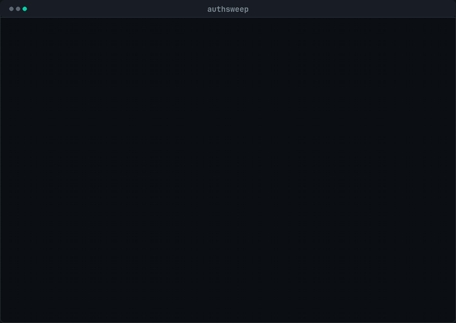

<div align="center">
  
  <h1>authsweep</h1>
  <p><strong>Finds route handlers with no authorization check.</strong><br>
  <sub>Deterministic, zero tokens, evidence on every finding — with an optional diverse-lens verify stage you have to opt into.</sub></p>
  <p><a href="https://unchained-labs.github.io/authsweep/">Docs</a> · <a href="#the-prefilter">The prefilter</a> · <a href="#severity">Severity</a></p>
</div>

<div align="center">
  
  <br><sub>16 of 25 routes prefiltered before any agent ran. <a href="https://unchained-labs.github.io/authsweep/">Full docs →</a></sub>
</div>

---

**Status: alpha.** The scan is deterministic and tested; the heuristics will
produce false positives on unusual auth architectures. Read the evidence line on
every finding before acting on it.

```
$ authsweep scan .

  authsweep  4 files · 25 routes · express, flask, fastapi

  prefilter  16 of 25 routes dropped before any agent ran
             64% of the fan-out, for zero tokens

  ✗ DELETE /admin/users/:id/roles  src/routes/admin.js:18
     app.delete('/admin/users/:id/roles', (req, res) => dropRoles(req.params.id))
     no authorization check found on or above this handler · DELETE changes state ·
     administrative surface · operates on user records · takes an id or wildcard

  ✗ POST /billing/charge  src/routes/billing.js:19
     app.post('/billing/charge', (req, res) => charge(req.body))
     no authorization check found on or above this handler · POST changes state · touches money

  7 high · 1 medium · 1 low
```

## The prefilter

This is the point of the tool. Enumerating routes and asking *does this one
reference the auth middleware at all?* is `grep` with a parser attached —
deterministic, instant, free — and on a real codebase it removes **more than half
the work before any model runs.**

The reference architecture calls this out as the step people skip: you pay full
price to have a model scan files that were obviously fine. `authsweep` does the
free half properly and hands you a much smaller list.

Routes are dropped when they:

- reference a guard on the handler, its middleware chain, or at router level
  (`app.use(requireAuth)` covers everything below it),
- are conventionally public (`/health`, `/metrics`, `/auth/login`, `/.well-known/*`),
- are marked public in a comment or decorator (`// public`, `@public`, `no-auth`),
- are stubs that return `501` or `NotImplementedError`.

**Every prefilter decision is recorded and auditable** — `--format json` includes
the dropped routes and the reason each one was dropped. A prefilter you cannot
inspect is a prefilter you cannot trust.

## Severity

A missing check on `DELETE /admin/users/:id/tokens` and a missing check on
`GET /search` are not the same event. A scanner that reports them at the same
level teaches you to ignore both.

| Factor | Weight |
| :--- | ---: |
| Mutating verb (POST/PUT/PATCH/DELETE) | +2 |
| `admin`, `internal`, `private`, `debug` | +3 |
| Money — `billing`, `charge`, `refund`, `payout` | +3 |
| Credentials — `token`, `secret`, `key`, `password` | +3 |
| Authorization state — `role`, `permission`, `scope`, `grant` | +3 |
| User records — `user`, `account`, `tenant`, `member` | +2 |
| Bulk egress — `export`, `download`, `dump`, `backup` | +2 |
| Takes an id or wildcard | +1 |

`high` at 4+, `medium` at 2–3, `low` below. Every clause that contributed appears
on the finding, so you can disagree with the score and see exactly why it scored.

## Evidence or nothing

Every finding carries the **verbatim source line** it came from. A finding without
a quotable span is a guess, and a security tool that emits guesses gets muted. The
SARIF output carries the snippet too, so the GitHub Security tab shows the code
rather than a description of it.

## Install

```sh
npm i -g authsweep      # or npx authsweep scan .
```

## Usage

```sh
authsweep scan [paths...]         # deterministic scan, zero tokens
authsweep routes [paths...]       # every route found, guarded or not
authsweep verify-spec [paths...]  # emit the verify stage as a workflow spec
```

| Flag | Effect |
| :--- | :--- |
| `--format text\|json\|sarif` | `sarif` uploads to the GitHub Security tab. |
| `--verbose`, `-v` | Include the verification question per finding. |
| `--fail-on high\|medium\|low` | Exit 1 at or above this severity (default `high`). |
| `--lenses a,b,c` | Lenses for `verify-spec`. |

### Supported

| Language | Frameworks |
| :--- | :--- |
| JS / TS | Express, Fastify (both call and object form), Koa |
| Python | FastAPI (including `Depends` and router-level dependencies), Flask (including `methods=`) |

TypeScript annotations are stripped before parsing, length-preserving, so line
numbers stay correct.

### CI

```yaml
- run: npx authsweep scan . --format sarif > authsweep.sarif
- uses: github/codeql-action/upload-sarif@v3
  with: { sarif_file: authsweep.sarif }
```

## The verify stage is opt-in

The scan is free. Verification costs money, so `authsweep` **hands you the graph
instead of quietly spawning `3 × findings` agents on your behalf**:

```sh
authsweep verify-spec . > verify.graph.json
graphlint check verify.graph.json     # lints clean
preflight estimate verify.graph.json  # 25 agents, $0.36
```

The emitted spec is tiered, schema-bound, budgeted, uses three *distinct* lenses,
and carries a `barrierReason` on its one barrier — it passes
[graphlint](https://github.com/Unchained-Labs/graphlint) with no findings, which
is asserted in CI. Low-severity findings are excluded from the paid stage.

## What it does not do

- **It is not a taint analyser.** It answers "is there an auth check here", not
  "is the auth check correct". A route with `requireAuth` that then reads
  `req.params.id` without an ownership check is invisible to it.
- **It will miss unusual architectures.** Auth enforced in a gateway, a service
  mesh, a decorator factory, or generated code will read as missing. Mark those
  routes public or exclude the path.
- **It does not read Rust.** Express, Fastify and Koa (JS/TS) plus FastAPI and
  Flask (Python). An axum or actix service is invisible to it today.
- **It will produce false positives.** That is the trade for zero tokens and no
  network. Read the evidence line.
- **A file it cannot parse is reported, never assumed clean.** Unparseable files
  are listed in the output and the JSON summary.
- **It does not run scans against other people's repositories.** If you want to
  do that, the responsible-disclosure decisions are yours to make.

## Development

```sh
pnpm install && pnpm build && pnpm test   # 51 tests
node dist/cli.js scan test/fixtures --verbose
```

The fixtures include the cases that must be prefiltered — a router-level
`app.use` guard, an auth-named `Depends()` signature, a Flask `methods=` list, a
stub handler, a `// public` comment — because a prefilter that is too aggressive
is worse than no prefilter.

`di_not_auth.py` is the fixture that matters most. FastAPI's `Depends()` is
general dependency injection, and an earlier version of this tool counted *any*
`Depends()` as an auth check. Run against a real service, it reported "every route
has an authorization check" while two paid endpoints were wide open — a false
clean, which is the worst thing this tool can do, because silence reads as safety.
`Depends()` now only counts when the dependency is named like an auth check.

## Licence

MIT. Part of [Unchained Labs](https://unchained-labs.github.io/).
